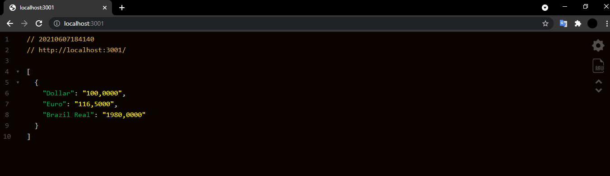
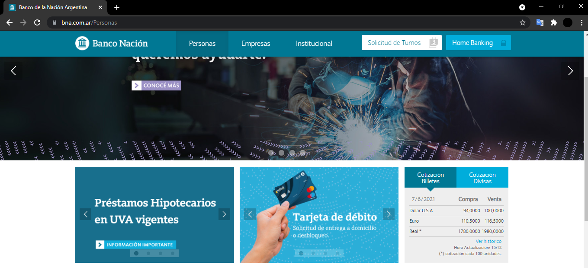

# Getting Started

This project includes Nodejs and the library Puppeteer.

We use "web scraping", on the BNA website to get the price of various currencies against the argentine peso.

## Available Scripts

In the project directory you should execute:

### `npm install`

To install the modules required to run the app.

### `npm test`

To use the app in the development mode.\
Open [http://localhost:3001](http://localhost:3001) to view it in the browser.

The page will reload if you make edits.\
You will also see any lint errors in the console.

---
In the browser you should see something like this

&nbsp;&nbsp;

---
The official website BNA

&nbsp;&nbsp;

---